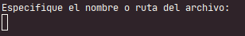
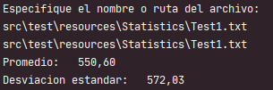
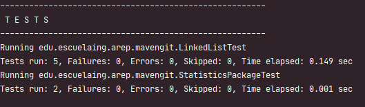

# Promedio y desviación estándar con Lista Enlazada

Este proyecto contiene la implementación del cálculo de promedio y desviación estándar de una muestra poblacional.
Para realizar los cálculos se utiliza una implementación propia de una lista enlazada que utiliza al API _**Collection**_ de java

## Empezando

Estas instrucciones te dejarán instalar y probar las funciones de estos paquetes.
El alcance de esta instalación, ejecución de clase principal y pruebas.

 
### Prerrequisitos

Para instalar y correr exitosamente este proyecto necesitamos:
* **Java**
* **Maven**
* **Git**


### Instalación

Primeramente vamos a descargar el repositorio en nuestra máquina local, y en la carpeta de 
nuestra preferencia. En consola vamos a digitar el siguiente comando para clonar el repositorio.

```
git clone https://github.com/alejovasquero/AREP-MavenGit
```

Entremos a el directorio del proyecto

```
cd Primer-Taller
```

Debemos compilar el proyecto, que contiene las clases necesarias para poder correr nuestro
proyecto. Por medio de maven vamos a crear todos los compilables **.class**. Desde consola, y ubicados en la carpeta donde se encuentra
nuestra configuración de maven.

```
mvn compile
```

Ahora que nuestras clases etan compiladas vamos a ejecutar la clase principal para
ver el código en acción : )

```
mvn exec:java -Dexec.mainClass="edu.escuelaing.arep.mavengit.StatisticsPackage"
```
Los datos del programa provienen de algún archivo de texto 
con números decimales.



Si vamos a insertar simplemente el nombre del archivo, 
debemos tener en cuenta que la búsqueda de este archivo será
en el directorio principal del proyecto.




También podemos insertar toda la ruta de nuestro archivo dentro del sistema


Nuestro proyecto está listo y al servicio para ser usado en lo que necesites : ).


## Corriendo las pruebas

Correr las pruebas dentro del proyecto es muy sencillo, 
y lo haremos por medio de una fase de maven, la fase __test__, del ciclo de vida __default__. 

```
mvn test
```



### Detalle de las pruebas para la lista enlazada (LinkedListTest)
* **sizeTest** : Pruebas del tamaño que debe tomar al insertar y eliminar
* **addTest** : Pruebas de adición a la lista enlazada
* **shouldNotRemoveTest** : Casos en los que remover no debería ser efectivo
* **shouldRemoveTest** : Casos en los que remover debería ser efectivo
* **shouldInsertAll** : Caso de inserción para el método del la API *Collection*, de addAll


### Detalle de las pruebas para paquete de estadísticas (StatisticsPackageTest)
* **shouldCalculateMean** : Pruebas con archivos de prueba con datos muestrales, y cálculo de promedio esperado
* **shouldCalculateDeviation** : Pruebas con archivos de prueba con datos muestrales, y cálculo de desviación estándar

## Construido con


* [Maven](https://maven.apache.org/) - Manejo de dependencias
* [Git](https://git-scm.com/) - Control de versiones
* [Java](https://www.java.com/es/) - Lenguaje de programación


## Autores

* **David Alejandro Vasquez Carreño** - *Trabajo inicial* - [alejovasquero](https://github.com/alejovasquero)

## Licencia

Este proyecto está licenciado bajo la licencia del MIT - Vea el [LICENSE.md](LICENSE.md) para más detalles

## Reconocimientos

* Victor S.Adamchik

